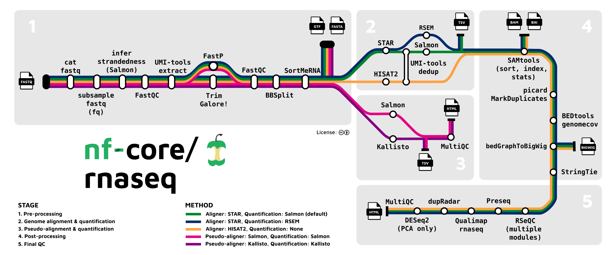

# Processing RNA sequencing data with nf-core

- [Processing RNA sequencing data with nf-core](#processing-rna-sequencing-data-with-nf-core)
  - [Overview :book:](#overview-book)
  - [Installation](#installation)
    - [Create nextflow environment :snake:](#create-nextflow-environment-snake)
    - [Download and compile RSEM](#download-and-compile-rsem)
  - [Prepare your sample sheet :pencil:](#prepare-your-sample-sheet-pencil)
  - [Run the pipeline :green\_apple:](#run-the-pipeline-green_apple)
    - [Start a new interactive session](#start-a-new-interactive-session)
    - [Test your set-up (optional) :safety\_vest:](#test-your-set-up-optional-safety_vest)
    - [Download genome files](#download-genome-files)
      - [Human genome files :man::woman:](#human-genome-files-manwoman)
      - [Mouse genome files :mouse:](#mouse-genome-files-mouse)
    - [Run your RNA sequencing reads :dna:](#run-your-rna-sequencing-reads-dna)
      - [Human run script :man::woman:](#human-run-script-manwoman)
      - [Mouse run script :mouse:](#mouse-run-script-mouse)

## Overview :book:

Here we will describe the process for processing RNA sequencing data using the [**nf-core/rnaseq**](https://nf-co.re/rnaseq) pipeline. This document was written as of version 3.14.0

**nf-core/rnaseq** is a bioinformatics pipeline that can be used to analyse RNA sequencing data obtained from organisms with a reference genome and annotation. It takes a samplesheet and FASTQ files as input, performs quality control (QC), trimming and (pseudo-)alignment, and produces a gene expression matrix and extensive QC report.

Full details of the pipeline and the many customisable options can be view on the pipeline website.



## Installation

In this section, we discuss the installation process on the M3 MASSIVE cluster.

### Create nextflow environment :snake:

To begin with, we need to create a new environment using [**mamba**](https://github.com/mamba-org/mamba). Mamba is recommended here over conda due to its massively improved dependency solving speeds and parallel package downloading (among other reasons).

```bash
# Create environment
mamba create -n nextflow nextflow \
    salmon=1.10.0 fq fastqc umi_tools \
    trim-galore bbmap sortmerna samtools \
    picard stringtie bedtools rseqc \
    qualimap preseq multiqc subread \
    ucsc-bedgraphtobigwig ucsc-bedclip \
    bioconductor-deseq2

# Activate environment
mamba activate nextflow
```

### Download and compile RSEM

RSEM is a software package for estimating gene and isoform expression levels from RNA-Seq data.

```bash
# Download RSEM
git clone https://github.com/deweylab/RSEM

# Enter the directory (RSEM) and compile
cd RSEM; make
```

Make note of this directory for your run script so you can add this to your PATH variable.

## Prepare your sample sheet :pencil:

You will need to have a sample sheet prepared that contains a sample name, the `fastq.gz` file paths, and the strandedness of the read files.

If you are working with a single-ended sequencing run, leave the `fastq_2` column empty, but the header still needs to be included.

For example, `samplesheet.csv`:

```bash
sample,fastq_1,fastq_2,strandedness
CONTROL_REP1,AEG588A1_S1_L002_R1_001.fastq.gz,AEG588A1_S1_L002_R2_001.fastq.gz,auto
CONTROL_REP1,AEG588A1_S1_L003_R1_001.fastq.gz,AEG588A1_S1_L003_R2_001.fastq.gz,auto
CONTROL_REP1,AEG588A1_S1_L004_R1_001.fastq.gz,AEG588A1_S1_L004_R2_001.fastq.gz,auto
```

Each row represents a fastq file (single-end) or a pair of fastq files (paired end). Rows with the same sample identifier are considered technical replicates and merged automatically. The strandedness refers to the library preparation and will be automatically inferred if set to auto.

## Run the pipeline :green_apple:

### Start a new interactive session

Firstly, we will start a new interactive session on the M3 MASSIVE cluster.

```bash
smux n --time=2-00:00:00 --mem=64GB --ntasks=1 --cpuspertask=12 -J nf-core/rnaseq
```

Once we are inside the interactive session, we need to select an appropriate version of the Java JDK to use. For the Nextflow pipeline we will be running, we need at least **version 17+**.

```bash
# View available java JDK modules
module avail java

# Load an appropriate one (over version 17)
module load java/openjdk-17.0.2

# Can double-check the correct version is loaded
java --version
```

### Test your set-up (optional) :safety_vest:

This step is optional, but highly advisable for a first-time setup or when re-installing.

```bash
nextflow run nf-core/rnaseq -r 3.14.0 \
    -profile test \
    --outdir test \
    -resume \
    --skip-dupradar \
    --skip_markduplicates
```

* We skip the `dupradar` step, because to install `bioconductor-dupradar`, mamba wants to downgrade `salmon` to a very early version, which is not ideal :facepalm:
* We also skip the `markduplicates` step because it is not recommended to remove duplicates anyway due to normal biological duplicates (i.e. there won't just be 1 copy of a given gene in a complete sample) :mag::sparkles:

### Download genome files

To avoid issues with genome incompatibility with the version of STAR you are running, it is recommended to simply download the relevant genome fasta and GTF files using the following scripts, and then supply them directly to the function call.

#### Human genome files :man::woman:

```bash
#!/bin/bash
VERSION=111
wget -L ftp://ftp.ensembl.org/pub/release-$VERSION/fasta/homo_sapiens/dna/Homo_sapiens.GRCh38.dna_sm.primary_assembly.fa.gz
wget -L ftp://ftp.ensembl.org/pub/release-$VERSION/gtf/homo_sapiens/Homo_sapiens.GRCh38.$VERSION.gtf.gz
```

#### Mouse genome files :mouse:

```bash
#!/bin/bash
VERSION=111
wget -L ftp://ftp.ensembl.org/pub/release-$VERSION/fasta/mus_musculus/dna/Mus_musculus.GRCm39.dna_sm.primary_assembly.fa.gz
wget -L ftp://ftp.ensembl.org/pub/release-$VERSION/gtf/mus_musculus/Mus_musculus.GRCm39.$VERSION.gtf.gz
```

### Run your RNA sequencing reads :dna:

To avoid typing the whole command out (and in case the pipeline crashes), create a script that will handle the process. Two examples are given here, with one for human samples, and one for mouse samples.

* You will need to replace the RSEM folder location with your own path from above.
* Using the `save_reference` option stores the formatted genome files to save time if you need to resume or restart the pipeline.

#### Human run script :man::woman:

```bash
#!/bin/bash
module load java/openjdk-17.0.2
export PATH=$PATH:/home/mmacowan/mf33/tools/RSEM/

nextflow run nf-core/rnaseq -r 3.14.0 \
    --input samplesheet.csv \
    --outdir rnaseq_output \
    --fasta /home/mmacowan/mf33/scratch_nobackup/RNA/Homo_sapiens.GRCh38.dna_sm.primary_assembly.fa.gz \
    --gtf /home/mmacowan/mf33/scratch_nobackup/RNA/Homo_sapiens.GRCh38.111.gtf.gz \
    --skip_dupradar \
    --skip_markduplicates \
    --save_reference \
    -resume

```

#### Mouse run script :mouse:

```bash
#!/bin/bash
module load java/openjdk-17.0.2
export PATH=$PATH:”/home/mmacowan/mf33/tools/RSEM/”

nextflow run nf-core/rnaseq -r 3.14.0 \
	--input samplesheet.csv \
	--outdir rnaseq_output \
	--fasta /home/mmacowan/mf33/scratch_nobackup/RNA/Mus_musculus.GRCm39.dna_sm.primary_assembly.fa.gz \
	--gtf /home/mmacowan/mf33/scratch_nobackup/RNA/Mus_musculus.GRCm39.111.gtf.gz \
	--skip_dupradar \
	--skip_markduplicates \
	--save_reference \
	-resume
```